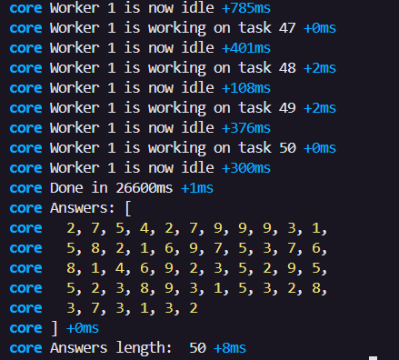
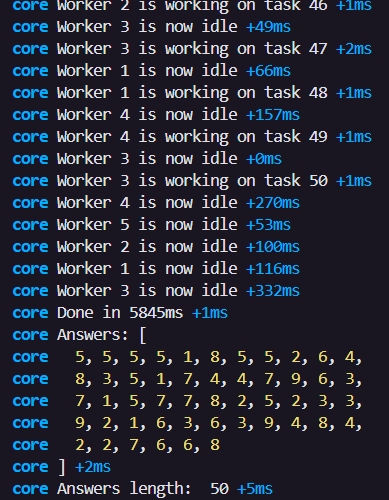

## Usage

Use the console to run the throttle.ts file using `npx` and show the debug logs with DEBUG var:

```
$env:DEBUG="*"; npx tsx throttle.ts
```

## Results

Using one worker, the code would take around 30s to run:

```
const answers = await throttle(1, load);
```



Using the default 5 workers, the code would take 5s to run:

```
const answers = await throttle(5, load);
```



Using 10 workers, the code would take around 3s to run:

```
const answers = await throttle(10, load);
```


